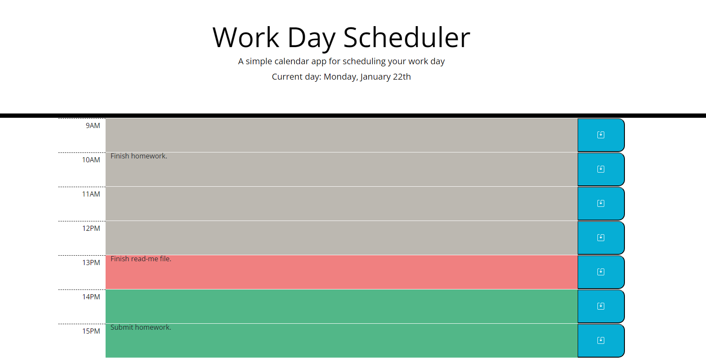

# work-scheduler

## Description
This application is a work schedule for the current day. It has the standard office work hours (9am-5pm). Each timeblock is dynamically colour coded, indicating the past(grey), present(red) and future(green). User can click on the description part of the timeblock and type in their work plan. The blue button act as a save button and will save the text to local storage. This app is built on js liberies such as jQuery and Day.js.

## Acceptance Criteria
* Display the current day at the top of the calender when a user opens the planner.
 
* Present timeblocks for standard business hours when the user scrolls down.
 
* Color-code each timeblock based on past, present, and future when the timeblock is viewed.
 
* Allow a user to enter an event when they click a timeblock

* Save the event in local storage when the save button is clicked in that timeblock.

* Persist events between refreshes of a page

## Screenshots
\

## Deployed URL
URL: 